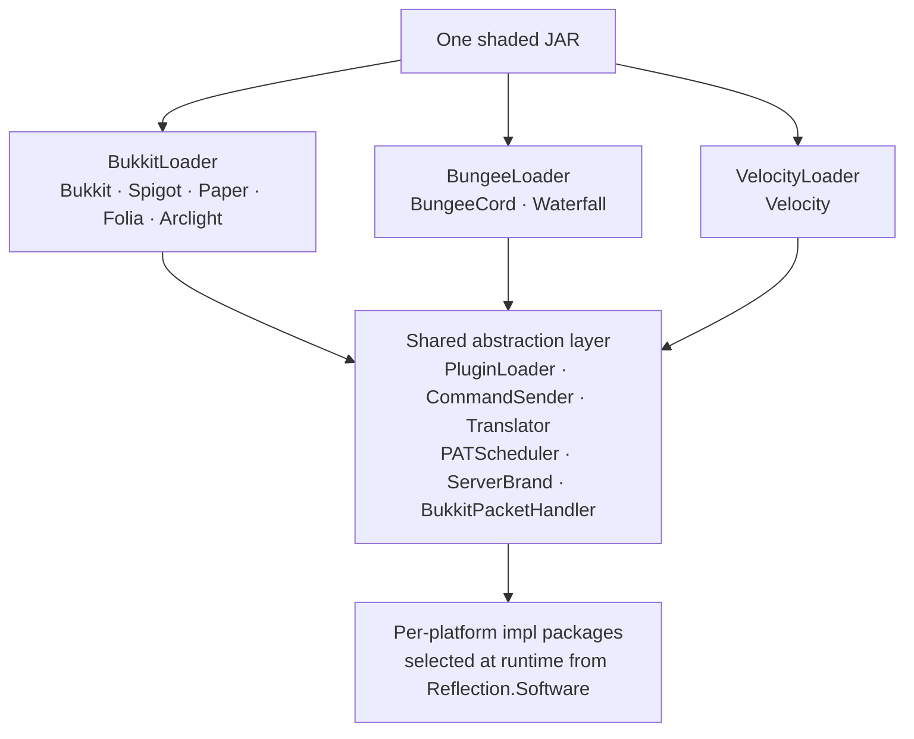

# AGENTS.md — ProAntiTab Architecture Guide

This document describes the architecture, package layout, and platform-boundary
strategy of **ProAntiTab**, a single-JAR Minecraft plugin that runs on Spigot,
Paper, Folia, BungeeCord, Waterfall, and Velocity.

It is intended as orientation for AI agents and developers working on the
codebase. It describes _how the project is structured and why_, not a task list.

---

## 1. Project Overview & Multi-Platform Strategy

ProAntiTab is one Gradle project that produces **one shaded JAR** which is loaded
by three different server families:

| Family        | Runtime                                | Entry point                                                 |
| ------------- | -------------------------------------- | ----------------------------------------------------------- |
| Bukkit family | Bukkit, Spigot, Paper, Folia, Arclight | `plugin/BukkitLoader` (`JavaPlugin`)                        |
| Bungee family | BungeeCord, Waterfall                  | `plugin/BungeeLoader` (`net.md_5.bungee.api.plugin.Plugin`) |
| Velocity      | Velocity                               | `plugin/VelocityLoader` (`@Plugin`, Guice-injected)         |



### How one JAR serves all of them

1. **Three independent entry points.** Each loader is a self-contained bootstrap
   that only references its own platform's API. The server platform decides which
   one to instantiate based on the descriptor it reads (`plugin.yml` for the
   Bukkit family, `bungee.yml` for Bungee, the `@Plugin` annotation for Velocity).
2. **A shared abstraction layer.** Everything below the loaders is written against
   platform-neutral interfaces (`PluginLoader`, `CommandSender`, `Translator`,
   `PATSchedulerTask`, `ServerBrand`, `BukkitPacketHandler`, …). Platform-specific
   behaviour lives in `impl` sub-packages that are only touched after the runtime
   software has been detected.
3. **Runtime software detection.** `utils/Reflection` probes for marker classes at
   startup and records the active `Software` enum value. All branching on the
   platform flows through this single source of truth.
4. **Descriptor filtering.** `ProcessResources` expands `plugin.yml` and
   `bungee.yml` from Gradle properties at build time, so each platform receives a
   descriptor with the correct `main` class.

### Design principles

- **Facade + interface + per-platform impl.** Cross-platform features are exposed
  as a static facade (e.g. `PATScheduler`, `MessageTranslator`, `Communicator`)
  that delegates to an interface implementation chosen at runtime.
- **Reflection at the edges.** Direct NMS/CraftBukkit access is confined to a
  small set of helpers (`utils/Reflection`, `utils/node/*`, the packet analyzers,
  `BukkitServerBrand`) so the rest of the code stays version-agnostic.
- **Proxy/backend split.** The plugin can run standalone on a backend server, or
  as a proxy + backend pair that synchronise over plugin messaging channels.

---

## 2. Core Directory & Package Layout

Root package: `de.rayzs.pat`.

```
de.rayzs.pat
├── api/            Public, platform-neutral API surface
├── plugin/         Platform entry points, listeners, and runtime systems
└── utils/          Shared helpers, abstractions, and per-platform implementations
```

### `api/` — public API surface

| Package                       | Responsibility                                                                                                                                                                                                                  |
| ----------------------------- | ------------------------------------------------------------------------------------------------------------------------------------------------------------------------------------------------------------------------------- |
| `api/event`                   | `PATEvent` / `PATEventHandler` and the event types (`FilteredSuggestionEvent`, `FilteredTabCompletionEvent`, `ExecuteCommandEvent`, `ServerPlayersChangeEvent`, `UpdatePlayerCommandsEvent`, `UpdatePluginEvent`, sync events). |
| `api/storage`                 | The central `Storage` facade and its `StorageTemplate` base.                                                                                                                                                                    |
| `api/storage/config/messages` | Typed config sections for user-facing messages (prefix, help, info, notifications, …).                                                                                                                                          |
| `api/storage/config/settings` | Typed config sections for behavioural settings (custom brand, custom plugins/versions, exploit patching, sync, update, …).                                                                                                      |
| `api/storage/blacklist`       | Blacklist/whitelist model and its `impl` variants (general, group, ignored servers).                                                                                                                                            |
| `api/storage/placeholders`    | Placeholder resolvers grouped by category (commands, groups, messages, general).                                                                                                                                                |
| `api/storage/storages`        | Concrete storage backends (blacklist, config, disabled/ignored servers, placeholders).                                                                                                                                          |

### `plugin/` — entry points and runtime systems

| Package                       | Responsibility                                                                                                                                                             |
| ----------------------------- | -------------------------------------------------------------------------------------------------------------------------------------------------------------------------- |
| `plugin`                      | The three loaders (`BukkitLoader`, `BungeeLoader`, `VelocityLoader`) and the `PluginLoader` interface they implement.                                                      |
| `plugin/command`              | Command framework: `CommandProcess`, `ProCommand`, and the `commands/` tree (local info/modify/system commands, server commands, and per-platform `impl` bridges).         |
| `plugin/listeners`            | Event listeners split by platform: `bukkit/`, `bungee/`, `velocity/`. Includes block-command, anti-tab, player-connection, ping, and LuckPerms-warning listeners.          |
| `plugin/packetanalyzer`       | Netty pipeline injection and packet inspection. `bukkit/` (with `handlers/` for legacy, modern, and command-node packets) plus `proxy/` analyzers for Bungee and Velocity. |
| `plugin/logger`               | `Logger` facade with per-platform `impl` backends and a `LoggerPriority` level.                                                                                            |
| `plugin/metrics`              | Vendored bStats integration (`bStats` facade + Bukkit/Bungee/Velocity metrics classes).                                                                                    |
| `plugin/system/communication` | Proxy↔backend messaging: `Communicator`, `BackendUpdater`, plugin-message clients (`pmc/`), packet handlers (`cph/`), and per-platform clients (`client/`).                |
| `plugin/system/subargument`   | Sub-argument (nested tab-completion) engine: argument builders, stacks, sources, and handlers.                                                                             |
| `plugin/system/converter`     | Importers that migrate blacklists from other plugins (PlHide, CommandWhitelist, PluginHiderPlus, …).                                                                       |
| `plugin/system/serverbrand`   | Custom server-brand (`F3` brand) system with per-platform `impl` backends.                                                                                                 |

### `utils/` — shared helpers and abstractions

| Package / class       | Responsibility                                                                                                                                                |
| --------------------- | ------------------------------------------------------------------------------------------------------------------------------------------------------------- |
| `utils/Reflection`    | Software/version detection and the reflection toolkit used across the project.                                                                                |
| `utils/scheduler`     | `PATScheduler` facade, `PATSchedulerTask` interface, and `impl/` (`BukkitScheduler`, `FoliaScheduler`).                                                       |
| `utils/message`       | `MessageTranslator` facade, the `Translator` interface, `translators/` (Bukkit/Bungee/Velocity), and `replacer/` for placeholder substitution.                |
| `utils/sender`        | `CommandSender` abstraction with per-platform `impl` (Bukkit/Bungee/Velocity).                                                                                |
| `utils/group`         | Group model (`Group`, `TinyGroup`) and `GroupManager`.                                                                                                        |
| `utils/hooks`         | Optional integrations: LuckPerms, GroupManager, PlaceholderAPI, ViaVersion.                                                                                   |
| `utils/permission`    | `PermissionUtil`, `PermissionMap`, and the `PermissionPlugin` enum.                                                                                           |
| `utils/response`      | `ResponseHandler` and the `action/` response-action model.                                                                                                    |
| `utils/configuration` | `Configurator` / `ConfigurationBuilder`, YAML/JSON backends (`yaml/`), typed helpers (`helper/`), per-platform builders (`impl/`), and the config `updater/`. |
| `utils/node`          | Brigadier command-tree helpers: `BukkitCommandNodeHelper` (packet-based) and `ProxyCommandNodeHelper` (proxy-based).                                          |
| `utils` (misc)        | `StringUtils`, `ArrayUtils`, `CommandsCache`, `CommunicationPackets`, `ConnectionBuilder`, `ExpireCache`, `PacketUtils`, `VersionComparer`.                   |

---

## 3. Platform Boundary Management

### 3.1 Software detection

`utils/Reflection.initialize(Object serverObj)` is called once by each loader and
resolves the active platform by probing for marker classes, in priority order:

- **Bukkit family** (when `org.bukkit.Server` is present): Arclight → Folia →
  Paper → Spigot → Bukkit.
- **Proxy family** (otherwise): Velocity → Waterfall → BungeeCord.

The probe keys off a single marker class per platform:

| Software   | Marker class                                        |
| ---------- | --------------------------------------------------- |
| Arclight   | `io.izzel.arclight.i18n.ArclightConfig`             |
| Folia      | `io.papermc.paper.threadedregions.RegionizedServer` |
| Paper      | `com.destroystokyo.paper.Metrics`                   |
| Spigot     | `org.spigotmc.SpigotConfig`                         |
| Velocity   | `com.velocitypowered.api.proxy.ProxyServer`         |
| Waterfall  | `io.github.waterfallmc.waterfall.QueryResult`       |
| BungeeCord | _(fallback when no proxy marker matches)_           |

The result is stored as a `Software` enum value that carries two capability flags:

| Flag            | Meaning                                                      |
| --------------- | ------------------------------------------------------------ |
| `paperBased`    | The software supports the Paper/Adventure-style API surface. |
| `proxySoftware` | The software is a proxy (BungeeCord/Waterfall/Velocity).     |

`Reflection` also derives the server version (`major`/`minor`/`release`) and
exposes comparison helpers (`isAtLeast`, `isAtMost`, `isBefore`, `isAfter`) plus
convenience predicates (`isProxyServer`, `isVelocityServer`, `isFoliaServer`,
`isPaper`, `isCraftbukkit`, `isArclight`). All platform branching in the codebase
is expected to go through these predicates rather than ad-hoc class checks.

### 3.2 Loader responsibilities

Each loader is the composition root for its platform. It:

1. Creates the default resource files (`Configurator.createResourcedFile`).
2. Calls `Reflection.initialize(...)`.
3. Initialises `Storage`, `CommandProcess`, `ConfigUpdater`, `GroupManager`,
   `MessageTranslator`, `Communicator`, `BackendUpdater`, metrics, and the
   server-brand system.
4. Registers its platform's listeners, commands, and packet analyzers.
5. Wires optional hooks (LuckPerms, GroupManager, PlaceholderAPI, ViaVersion,
   PAPIProxyBridge) when the corresponding plugin is present.

The `PluginLoader` interface normalises the operations the rest of the code needs
from a loader (player lookups, command enumeration, permission registration,
command-cache access, command updates), so shared code never references a
concrete loader type.

### 3.3 Scheduling boundary (Paper vs. Folia)

Folia replaces the global Bukkit scheduler with region/entity/async schedulers.
This is abstracted by:

- `PATScheduler` — a static facade with `createScheduler` / `createAsyncScheduler`
  / `execute` entry points.
- `PATSchedulerTask` — the returned handle (`isActive`, `cancelTask`, `setTaskId`).
- `impl/BukkitScheduler` — backed by `Bukkit.getScheduler()`.
- `impl/FoliaScheduler` — backed by `GlobalRegionScheduler`, `AsyncScheduler`, and
  the per-entity scheduler (`player.getScheduler()`).

`PATScheduler` selects the implementation from `Reflection.isFoliaServer()` at
call time, so callers stay platform-agnostic. Entity-bound work on Folia is
routed through `PATScheduler.execute(runnable, player)`.

### 3.4 Message boundary (Adventure)

`MessageTranslator` is the facade for all outbound text. It decides at startup
whether Adventure/MiniMessage support is available for the current software and,
if so, instantiates the matching `Translator`:

- `BukkitMessageTranslator` — uses native Adventure on Paper-family servers and
  `BukkitAudiences` elsewhere.
- `BungeeMessageTranslator` — uses `BungeeAudiences`.
- `VelocityMessageTranslator` — uses Velocity's native Adventure support.

The `Translator` interface covers `send`, `sendActionbar`, `sendTitle`,
`playSound`, and `close`, and provides a shared `toComponent` conversion so all
platforms render MiniMessage/legacy input consistently.

### 3.5 Packet boundary (tab-completion filtering)

Tab-completion filtering is implemented by injecting a Netty handler into the
player's channel pipeline:

- `BukkitPacketAnalyzer` — injects a `ChannelDuplexHandler` and dispatches to a
  `BukkitPacketHandler` implementation (`LegacyPacketHandler`,
  `ModernPacketHandler`, `ModernCommandsNodeHandler`) chosen by server version.
- `BungeePacketAnalyzer` / `VelocityPacketAnalyzer` — the proxy equivalents,
  operating on the proxy's command tree.

The proxy analyzers also drive the proxy↔backend command synchronisation through
`plugin/system/communication`.

### 3.6 Sender boundary

`utils/sender/CommandSender` unifies players and console across platforms. Its
`from(Object)` factory inspects the runtime software and returns the appropriate
`BukkitSender`, `BungeeSender`, or `VelocitySender`. Shared code (commands,
events, responses) works exclusively against this interface.

---

## 4. Build & Dependency System

### 4.1 Gradle Kotlin DSL layout

| File                        | Role                                                                                                                                                                                     |
| --------------------------- | ---------------------------------------------------------------------------------------------------------------------------------------------------------------------------------------- |
| `settings.gradle.kts`       | Declares `rootProject.name = "ProAntiTab"`.                                                                                                                                              |
| `build.gradle.kts`          | Plugins, repositories, dependencies, toolchain, resource processing, and ShadowJar configuration.                                                                                        |
| `gradle/libs.versions.toml` | Version catalog: `[versions]`, `[libraries]`, `[plugins]`. All dependency coordinates and versions are declared here and referenced as `libs.*`.                                         |
| `gradle.properties`         | Project metadata (`group`, `name`, `version`, `main`, `bungeeMain`, `description`, `website`, `author`, `apiVersion`, `foliaSupported`) consumed by the build and by resource expansion. |

### 4.2 Plugins

- `java` — standard JVM build.
- `com.gradleup.shadow` (ShadowJar) — produces the distributable plugin JAR.
- `xyz.jpenilla.run-paper` — provides `runServer` for local Paper testing.

### 4.3 Dependency scoping strategy

The dependency graph mirrors the multi-platform design:

- **`compileOnly`** — every server-bound API (Paper, Spigot, Folia, BungeeCord,
  Velocity, Waterfall, Netty, Mojang libraries, LuckPerms, PlaceholderAPI,
  ViaVersion, etc.). These are supplied by the server at runtime and must never be
  bundled.
- **`implementation`** — the Kyori Adventure stack (`adventure-api`,
  `adventure-text-minimessage`, `adventure-platform-api`,
  `adventure-platform-bungeecord`, `adventure-platform-bukkit`). These are not
  guaranteed to be present on every platform, so ShadowJar bundles them.

Repositories are declared per upstream host (Spigot, PaperMC, Sonatype, JitPack,
Velocity, ViaVersion, William278, Minecraft libraries, PlaceholderAPI).

### 4.4 ShadowJar packaging

`tasks.shadowJar` is configured to:

- Bundle the `runtimeClasspath` configuration (i.e. `implementation` dependencies
  and their transitive graph) while leaving `compileOnly` server APIs out.
- Clear the classifier so the shaded artifact is the primary output.
- Keep the relocation hook available for bundling third-party libraries into the
  plugin's own namespace.

`tasks.jar` is disabled and `tasks.build` depends on `shadowJar`, so the shaded
JAR is the canonical build artifact.

### 4.5 Resource processing

`tasks.withType<ProcessResources>` expands the platform descriptors from Gradle
properties:

- `plugin.yml` ← `name`, `main`, `version`, `description`, `website`, `author`,
  `apiVersion`, `foliaSupported`, plus the Adventure library versions.
- `bungee.yml` ← `name`, `bungeeMain`, `version`, `description`, `website`,
  `author`.

The default configuration files that ship inside the JAR live under
`src/main/resources/files/` (`bukkit-*.yml` for backends, `proxy-*.yml` for
proxies) and are copied into the server's data folder at runtime by
`Configurator.createResourcedFile`.

### 4.6 Java toolchain

The build targets a Java 21 toolchain. Source and resource encoding is fixed to
UTF-8 for both compilation and resource filtering.

---

## Quick reference — where to look

| Concern                               | Start here                                                           |
| ------------------------------------- | -------------------------------------------------------------------- |
| Add a new platform-specific behaviour | `utils/Reflection` (detection) + the relevant `impl` package         |
| Add a scheduled task                  | `utils/scheduler/PATScheduler`                                       |
| Add user-facing text                  | `utils/message/MessageTranslator` + `Translator` impls               |
| Add a command                         | `plugin/command/commands/...` + `CommandProcess`                     |
| Add a listener                        | `plugin/listeners/<platform>/`                                       |
| Add a config option                   | `api/storage/config/settings` or `.../messages`                      |
| Add a proxy↔backend message           | `plugin/system/communication` (`CommunicationPackets`, `cph`, `pmc`) |
| Add a dependency                      | `gradle/libs.versions.toml` then `build.gradle.kts`                  |
